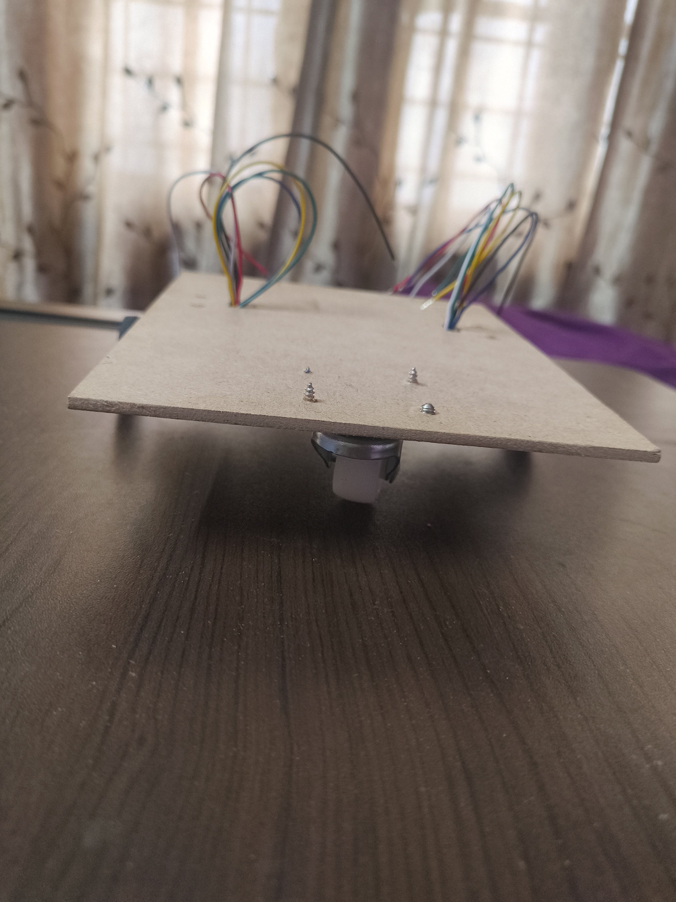
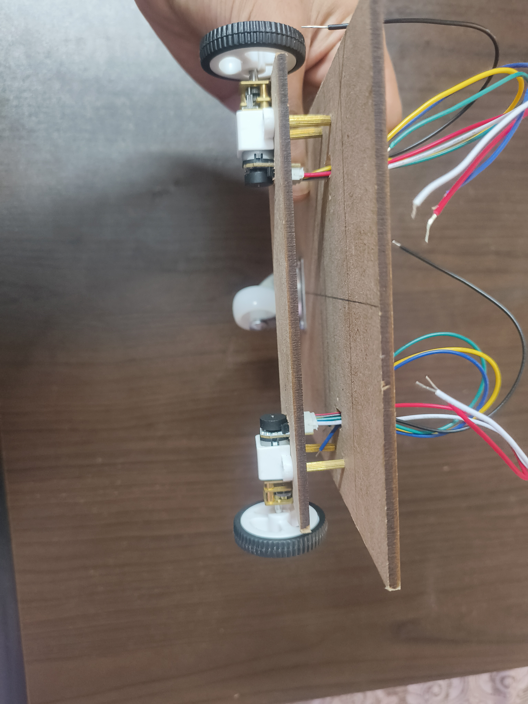

I made the chassis of the Rover using mdf boards as they were cheaper than acrylic.
The primary board i used is 18cm * 14cm. It is also 3mm in thickness.
I have used brass standoffs to add another mdf board under the primary one for the motors to get fixed onto as the castor wheel height was too much and the standoffs helped in making the rover level.
I added holes for the wires of the N20 motors to come through. This gave a very clean look.
Also i have used Screws for fixing everything in place.

----
**Time Spent** : Couple of hours(Did not observe)

**Date** : June 28th

  <table>
    <tr>
      <td style="text-align: center; border: none; background: transparent;">
        <!-- First Image -->
        
        <em>The Chassis</em>
      </td>
      <td style="text-align: center; border: none; background: transparent;">
        <!-- Second Image -->
         
        <em>The Chassis bottom</em>
      </td>
    </tr>
  </table>

