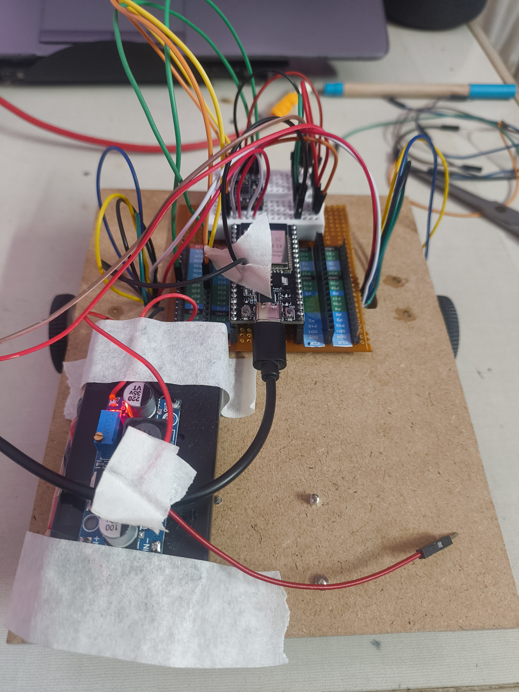
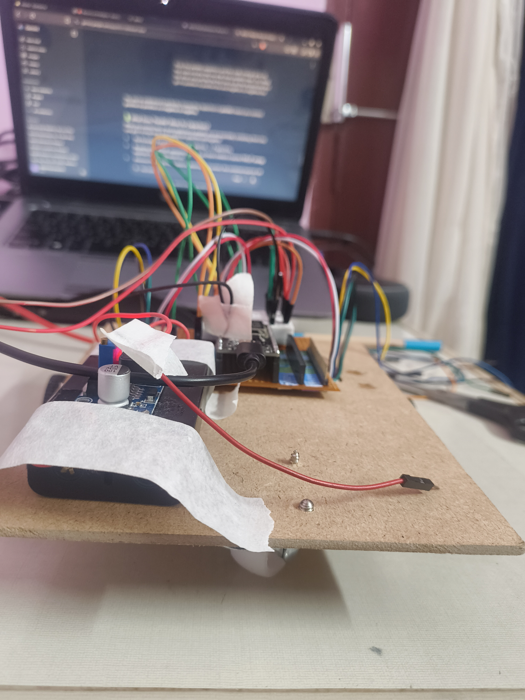

I have made the rover roam around using my phone as the controller. For now i have just connected using breadboard and held them using tape but im yet to make a pcb for it using a perfboard which will make this much more better

---

**Time Spent**: 1h 5m

**Date**: July 1st

  <table>
    <tr>
      <td style="text-align: center; border: none; background: transparent;">
        <!-- First Image -->
        
        <em>The Working Rover top</em>
      </td>
      <td style="text-align: center; border: none; background: transparent;">
        <!-- Second Image -->
         
        <em>The Working Rover</em>
      </td>
    </tr>
  </table>

