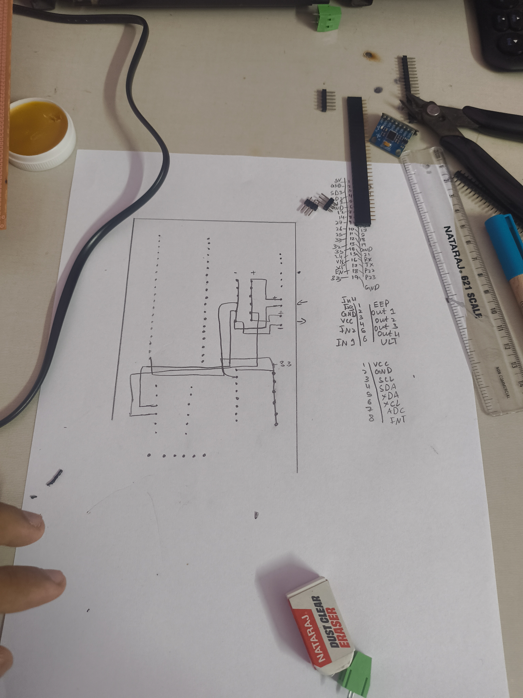

Today I planned out the circuit for the perfboard and also went ahead to make it but then i bought some solder wire recently and its the worst solder wire i have used in my life. It doesn’t stick to copper idk why. So I stopped it and i have to order some solder wire now. And also this is my first custom pcb so I dont even know how to use pcb design software so i thought going old school was better with pen and paper.

---

**Time Spent**: 46m

**Date**: July 2nd

  <table>
    <tr>
      <td style="text-align: center; border: none; background: transparent;">
        <!-- First Image -->
        
        <em>The Circuit Plan</em>
      </td>
      <td style="text-align: center; border: none; background: transparent;">
        <!-- Second Image -->
         
        <em>The Bad Solder Wire</em>
      </td>
    </tr>
  </table>

