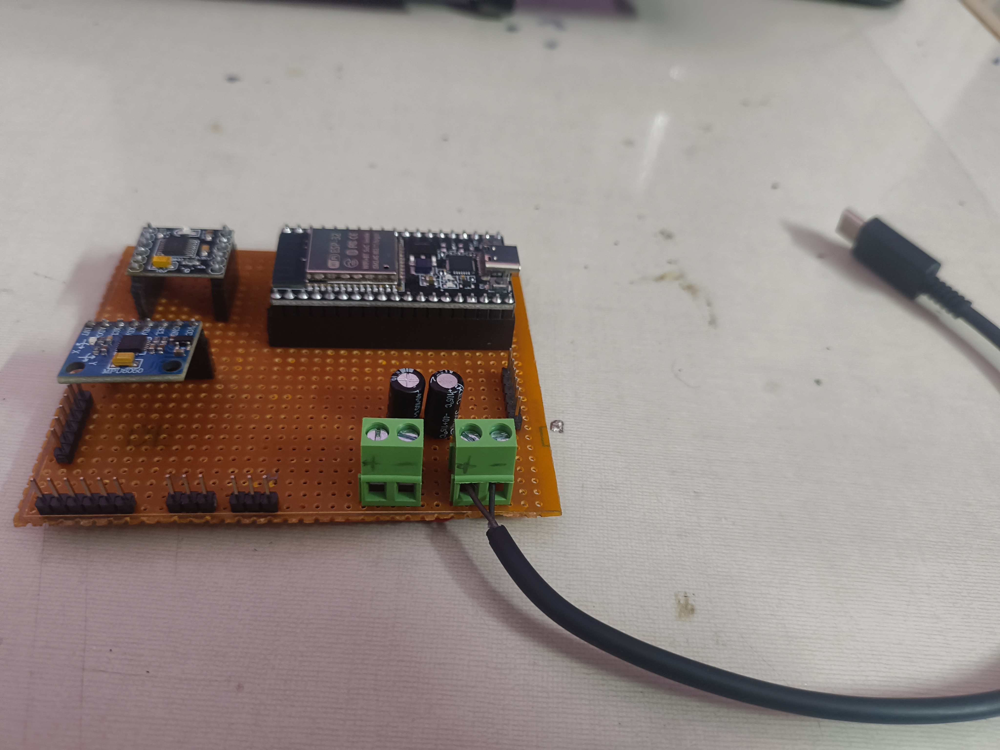
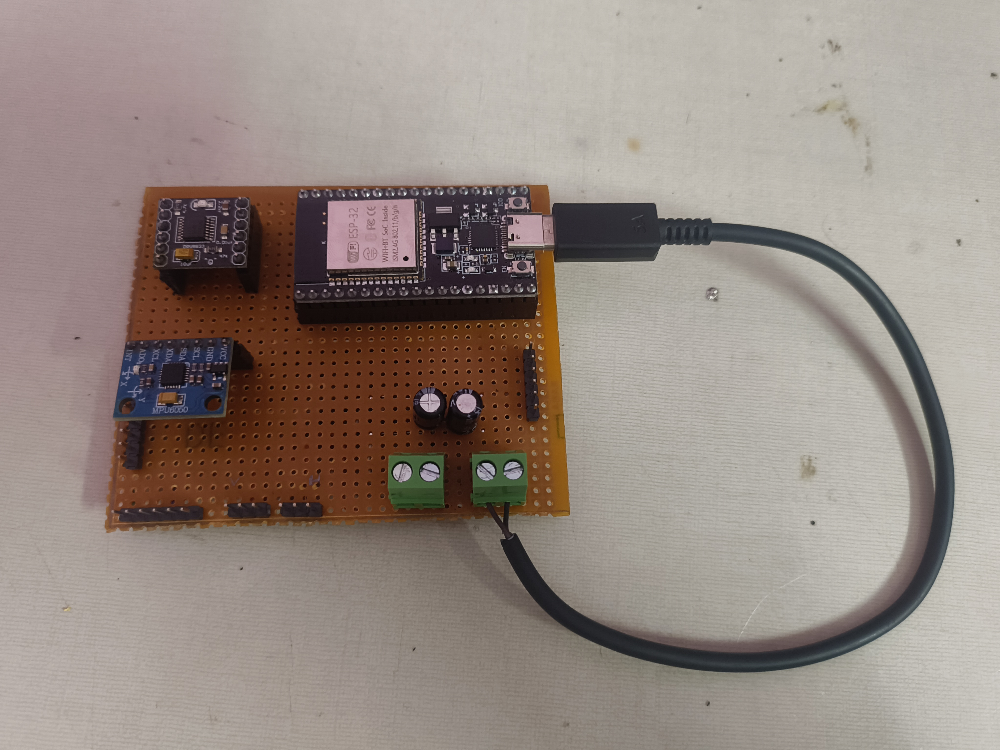
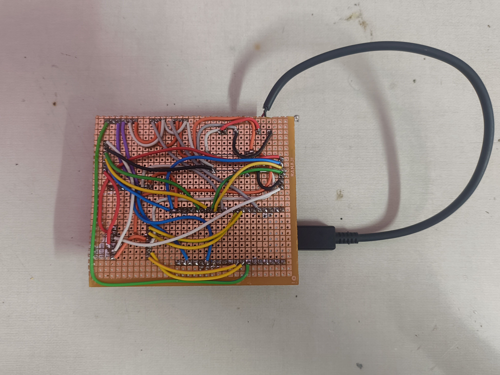
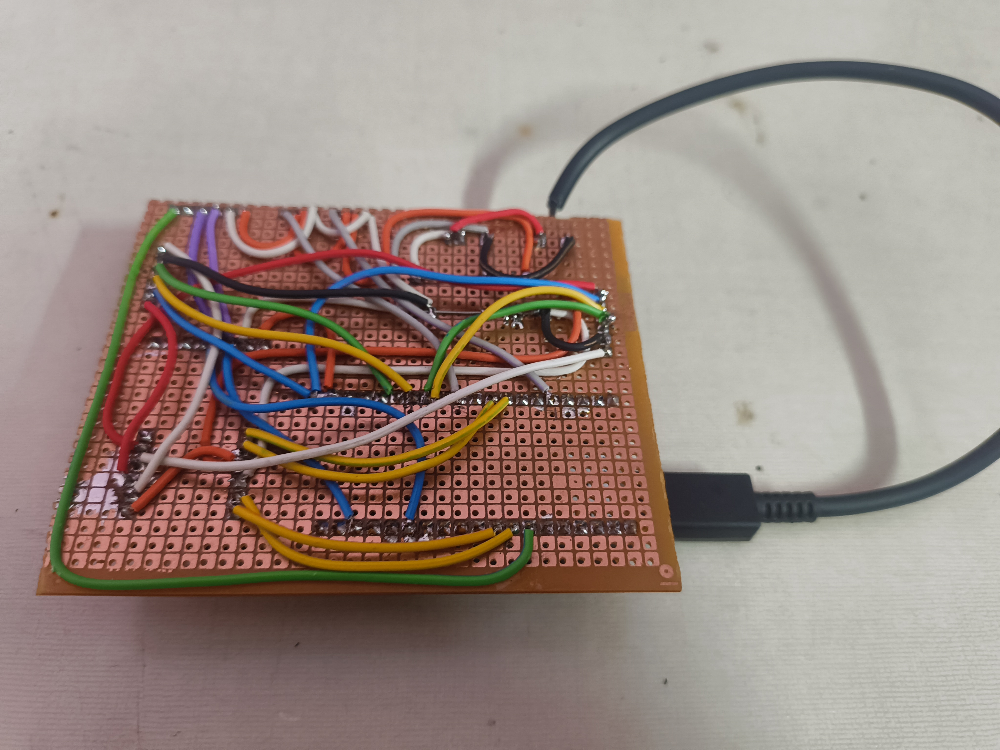

I have made the official PCB which is handmade using a perfboard.
It contains a Esp32, DRV8833 motor driver, MPU6050 Accelerometer. It also contains the male headers with premade connections.
The male headers are for the TOF sensor and the two servo motors in for the pan and tilt. It also contains a shared gnd and 5v which also consists of two 470uf capacitors to ensure good power supply to all the components.

The pcb is powered through two 18650 batteries with a buck converter to get seamless 5v current, It can be connected via a screw terminal. the other screw terminal is to power the esp32 via the c type port because thats giving me better reliability with the esp32.

This is my first self made pcb and it worked in the first try without any problems.

---

**Time Spent**: 4h 13m

**Date**: July 4th

  <table>
    <!-- TOP ROW (Images 1 and 2) -->
    <tr>
      <td style="text-align: center; border: none; background: transparent;">
         
        <em>PCB Side</em>
      </td>
      <td style="text-align: center; border: none; background: transparent;">
         
        <em>PCB Top</em>
      </td>
    </tr>
    <!-- BOTTOM ROW (Images 3 and 4) -->
    <tr>
      <td style="text-align: center; border: none; background: transparent;">
         
        <em>PCB Bottom 1</em>
      </td>
      <td style="text-align: center; border: none; background: transparent;">
         
        <em>PCB Bottom 2</em>
      </td>
    </tr>
  </table>

