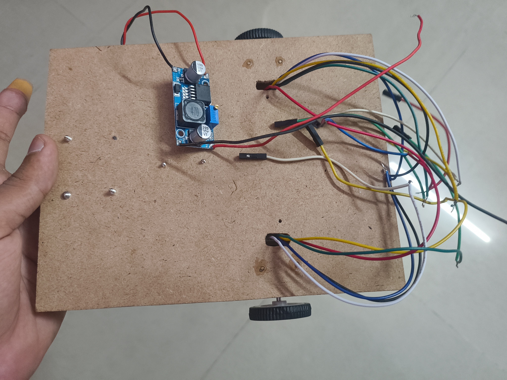
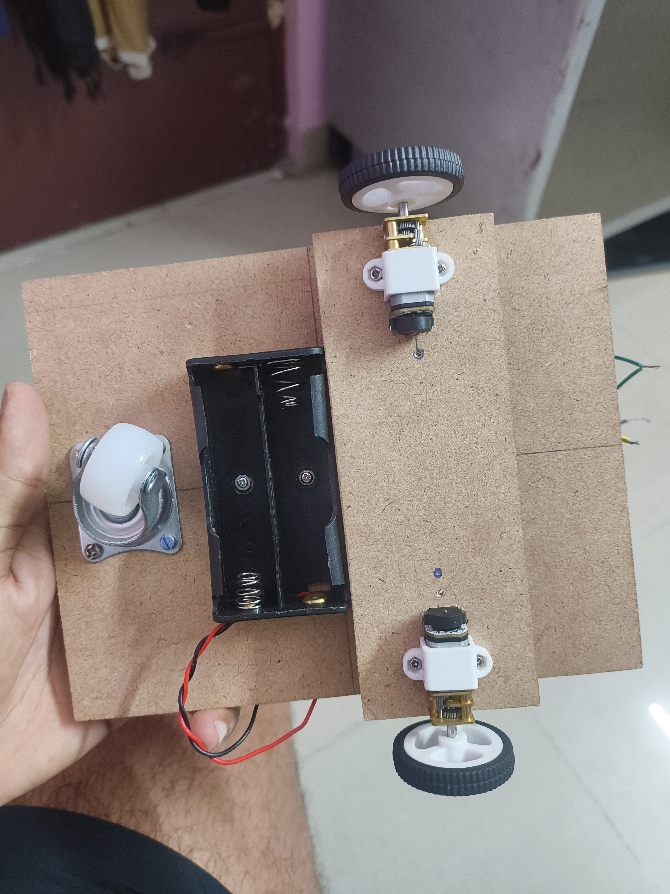

I fixed some wiring issues and also i mounted the battery holder and added the buck converter and yeah of course i burned my finger on the soldering iron😭

---

**Time Spent**: 1h 44m

**Date**: July 10th

  <table>
    <tr>
      <td style="text-align: center; border: none; background: transparent;">
        <!-- First Image -->
        
        <em>Wires going to the motors fixed.</em>
      </td>
      <td style="text-align: center; border: none; background: transparent;">
        <!-- Second Image -->
         
        <em>Added the battry holder underneath the rover.</em>
      </td>
    </tr>
  </table>

