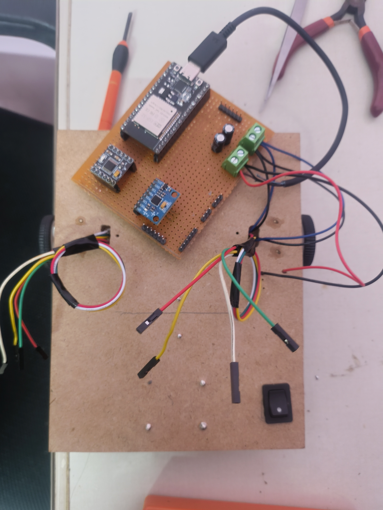
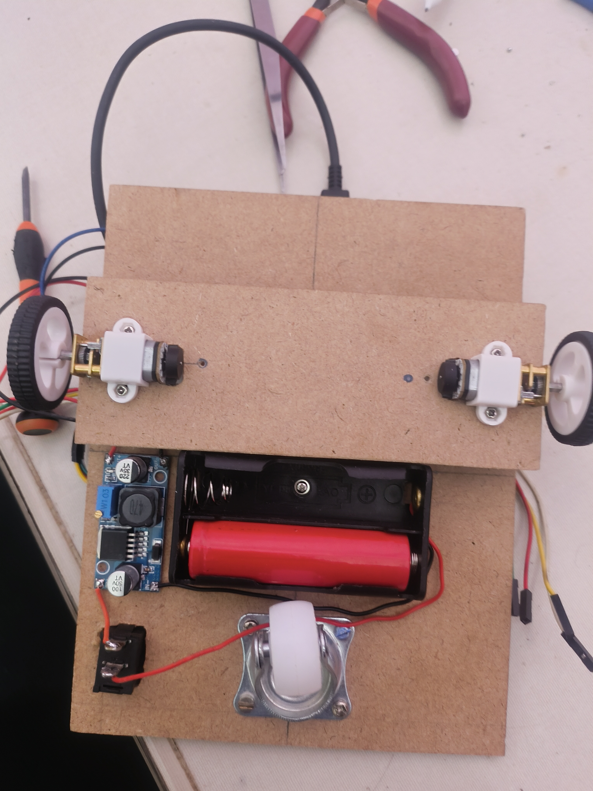

I made the wire connection from the motors to the board a it better and i taped everything to make sure nothing touches smtg thats not meant to be touched.

I also added a switch in between the battery holder and the buck converter so that i don’t need to take out the batteries every time apart from charging.

---

**Time Spent**: 2h 10m

**Date**: July 12th

  <table>
    <tr>
      <td style="text-align: center; border: none; background: transparent;">
        <!-- First Image -->
        
        <em>Made the wires a bit organized using tape.</em>
      </td>
      <td style="text-align: center; border: none; background: transparent;">
        <!-- Second Image -->
         
        <em>Added the Switch.</em>
      </td>
    </tr>
  </table>

