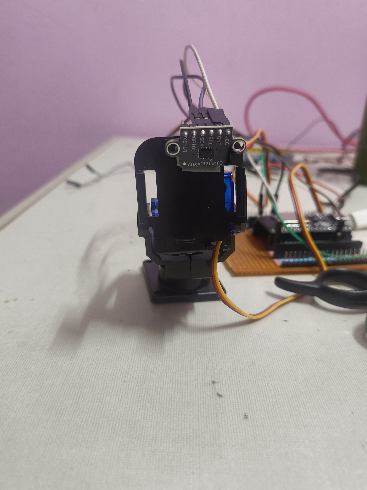
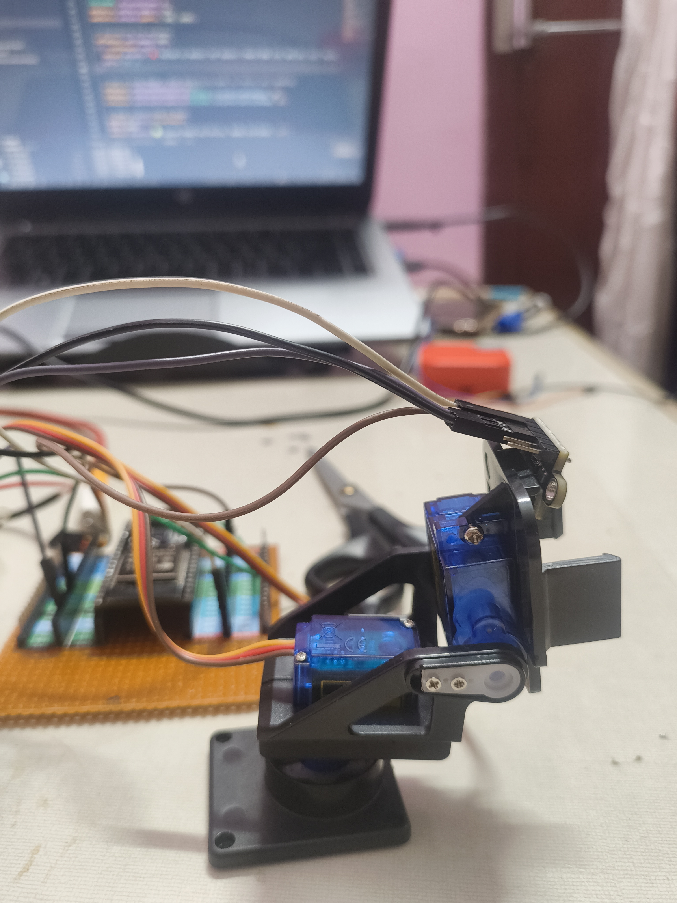

I have tested the servo motor and the TOF sensor to see if the mount was working perfectly and to check if the TOF is also working good.
 
There was a bit of shaking or vibration because the servo motor was not very accurate and i have to stop it every 2 degrees for the TOF sensor to measure the distance.
 
It was solved partially by connection the servo o external power supply which wont be the problem with the rover as its powered using 2 18650 batteries.
 
By tweaking the speed and degrees of the servo it was further improved and the data was fine not bad but not great either. I think to properly make the data show we need to use ROS.

---
**Time Spent**: 1h 26m

**Date**: July 12th

  <table>
    <tr>
      <td style="text-align: center; border: none; background: transparent;">
        <!-- First Image -->
        
        <em>The servo motors with the mount angle 1.</em>
      </td>
      <td style="text-align: center; border: none; background: transparent;">
        <!-- Second Image -->
         
        <em>The servo motors with the mount angle 2.</em>
      </td>
    </tr>
  </table>

