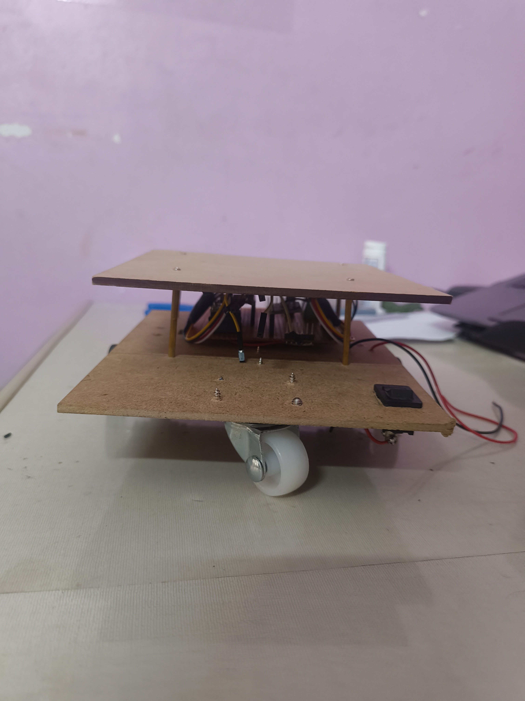
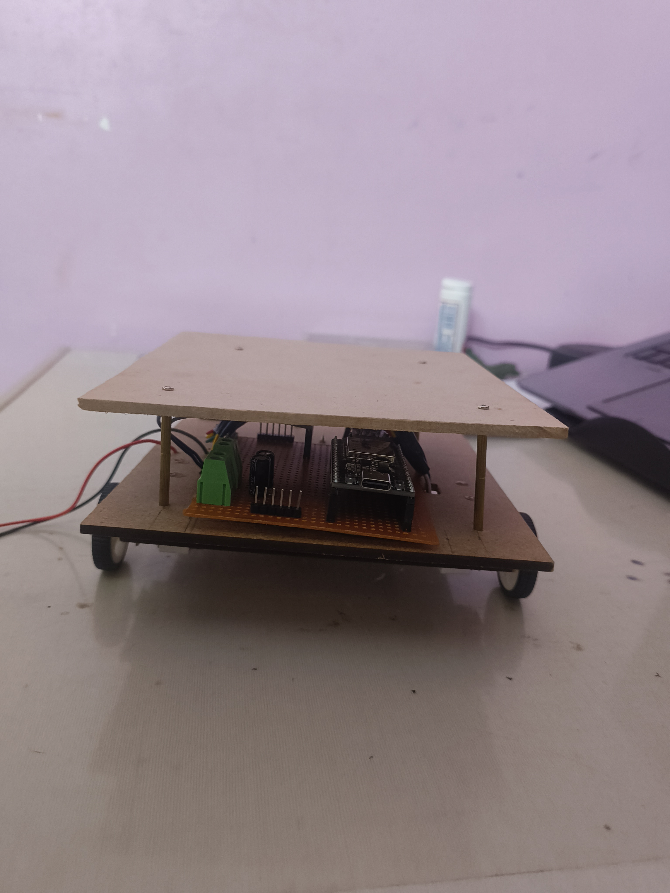
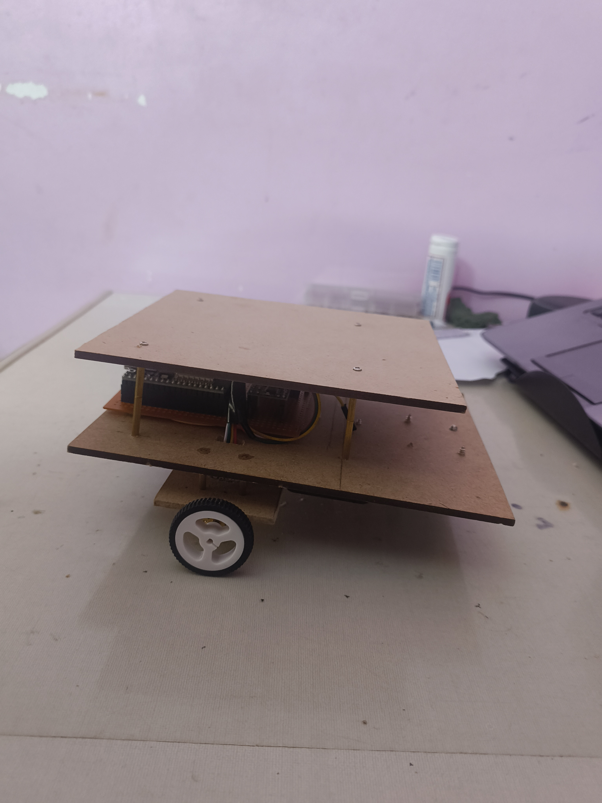
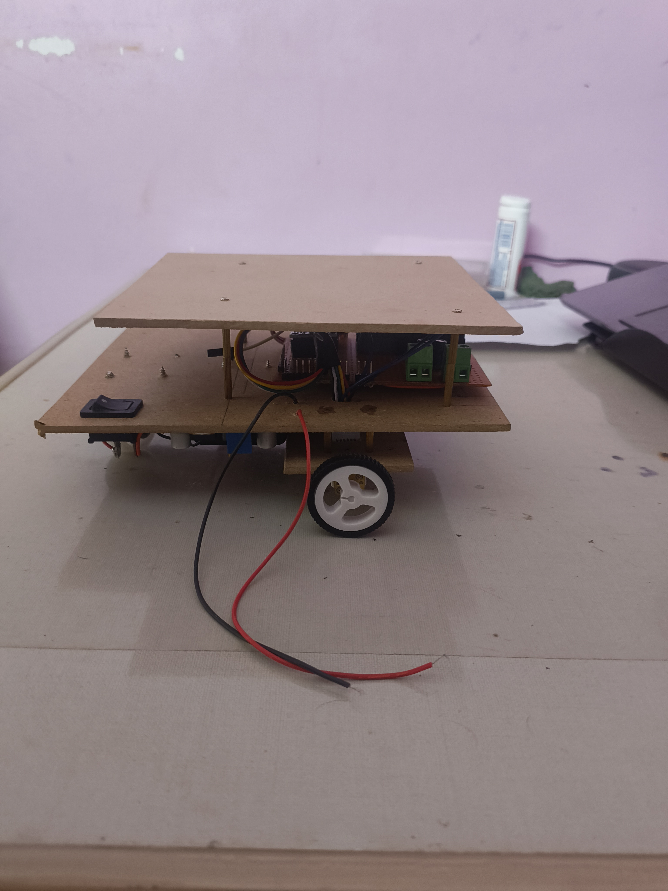

I have added another mdf board on top of the pcb using brass standoffs. This majorly gives me two advantages.

 1. It keeps all the wires and the circuits hidden under the upper plate which makes the rover look neat.

 2. It gives me space on the top and also some height for the servo and the TOF sensor to keep so that there is nothing that        interferes with the TOF sensor while its reading the distances. This makes it have no false reading which gives us a good       result.

I also did observe that the rover is tilting a bit to the front which i think is not a big problem as it can be solved using the tilt servo in the servo mount. We can use the built in MPU6050 to get the exact tilt and counter it giving us perfect 90 degree readings.

---

**Time Spent**: 1h 14m

**Date**: July 13th

  <table>
    <!-- TOP ROW (Images 1 and 2) -->
    <tr>
      <td style="text-align: center; border: none; background: transparent;">
         
        <em>Front of the Rover</em>
      </td>
      <td style="text-align: center; border: none; background: transparent;">
         
        <em>Bak of the Rover</em>
      </td>
    </tr>
    <!-- BOTTOM ROW (Images 3 and 4) -->
    <tr>
      <td style="text-align: center; border: none; background: transparent;">
         
        <em>Right side of the Rover</em>
      </td>
      <td style="text-align: center; border: none; background: transparent;">
         
        <em>Left side of the Rover</em>
      </td>
    </tr>
  </table>

