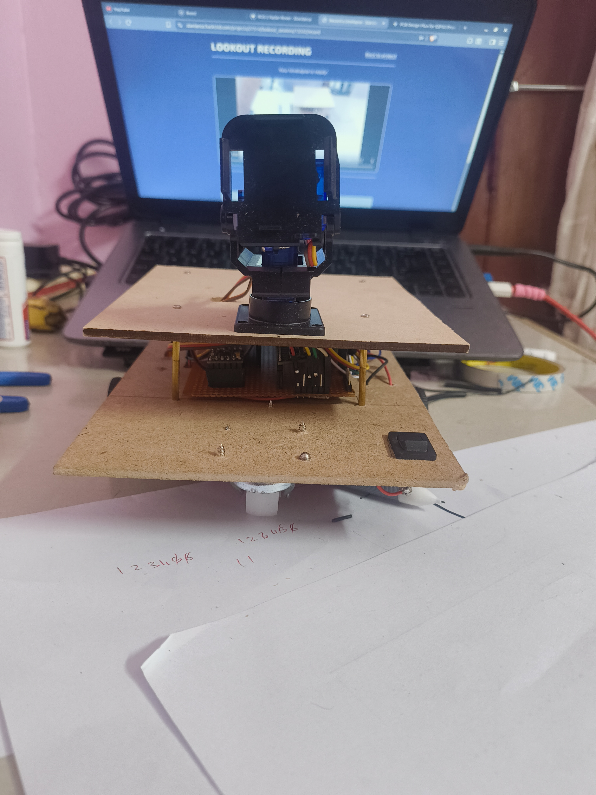
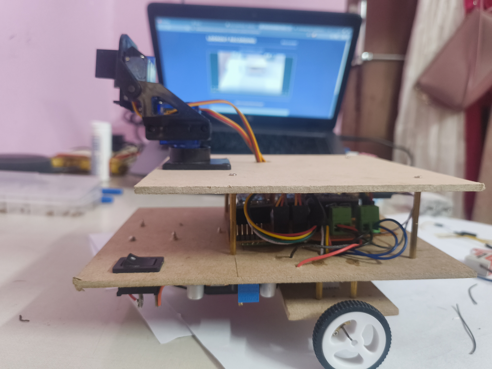

I have fixed the servo pan and tilt mount on the rover.
 
I have also tested the servos and they work perfectly. Ihave driven the rover with the servos running in full speed and the rover is still very stable to visible wobble was there.
 
But when the servo run very slow there is some shake in the mount. I think I should do smtg to prevent that as the scans would heavily get disturbed with vibrations.

---

**Time Spent**: 2h 1m

**Date**: July 16th

  <table>
    <tr>
      <td style="text-align: center; border: none; background: transparent;">
        <!-- First Image -->
        
        <em>Front view of the rove with the mount.</em>
      </td>
      <td style="text-align: center; border: none; background: transparent;">
        <!-- Second Image -->
         
        <em>Side view of the rover with the mount.</em>
      </td>
    </tr>
  </table>

