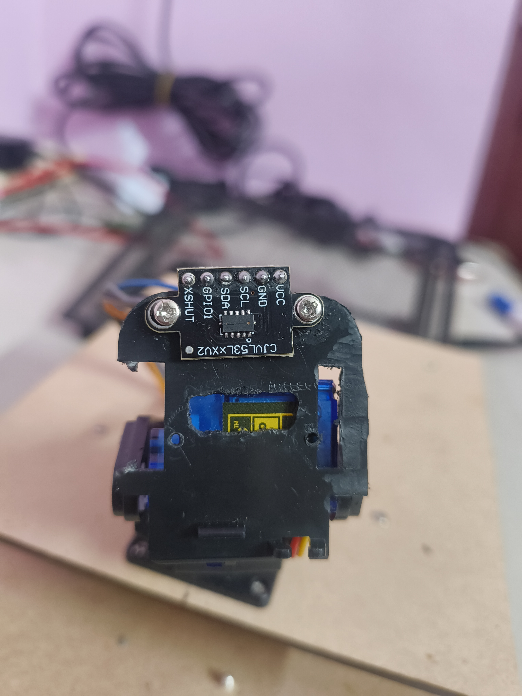
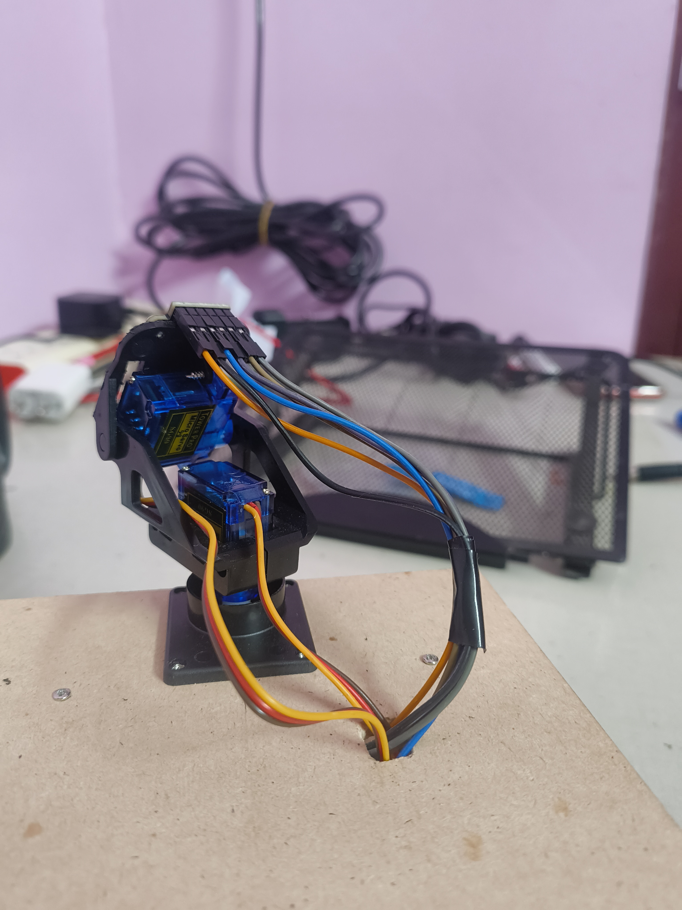

I have attached the TOF sensor to the servo mount.
 
I first removed the servos then made holes to fit the TOF sensor but then when I added the servos I got to know that the servos were in the way. So i had to move the TOF sensor and at last i figured it out and screwed it in place.

---

**Time Spent**: 2h 1m

**Date**: July 16th

  <table>
    <tr>
      <td style="text-align: center; border: none; background: transparent;">
        <!-- First Image -->
        
        <em>Front view of the TOF sensor.</em>
      </td>
      <td style="text-align: center; border: none; background: transparent;">
        <!-- Second Image -->
         
        <em>Rear view of the TOF sensor.</em>
      </td>
    </tr>
  </table>

