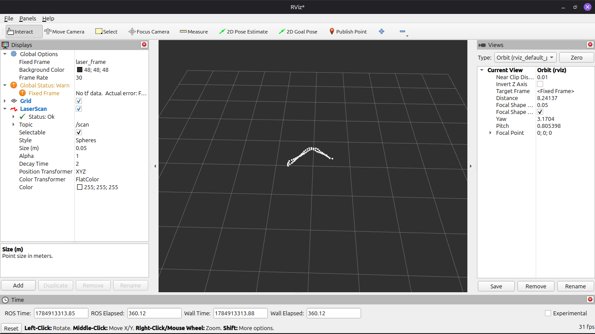

I have officially made the rover work a bit. Today I have made it so that I can actually see the TOF sensor work like a psudo-liDAR. In rviz i have plotted some dots which is the edge of my room.

This is just from the perspective of the rover which means where ever the rover is pointing it will only scan that particular area. Next I’m going to make the rover move and then it will plot the are from third person view and it will actually start mapping the room

---

**Time Spent**: 1h 54m

**Date**: July 24th

  
