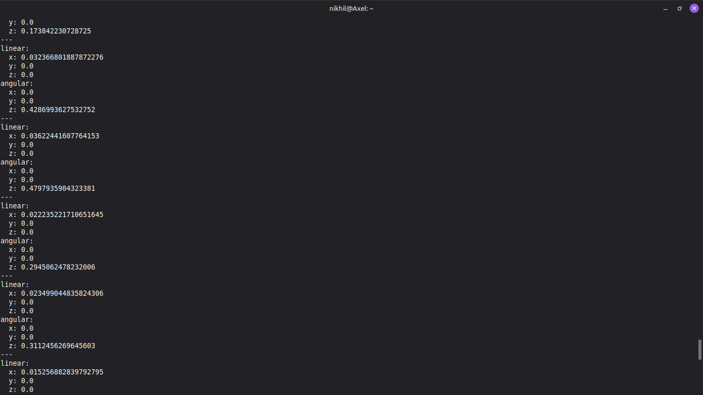

I wrote a lot of code today!
So today I did two things

I wrote some c++ code for the rover and uploaded it to the esp32. It basically gets all the values of the motor encoders and send them to the laptop ROS2 node.

I wrote a python script to calculate all those encoder ticks and change them to x and y acceleration and also linear z acceleration for the turning. This allowed me to see live the acceleration in x, y and also z(twisting)

---

**Time Spent**: 3h

**Date**: July 26th

  
