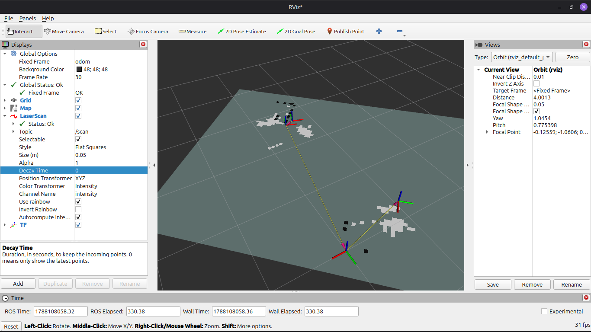

Today I have solved a lot of bugs and glitches that is making the project not work properly.
These the the things I changed today:

1. The yellow wire of the encoder was loose so I had to resolder that.
2. I use a screw terminal for the power of the motors which is 3.3v and I had to replace the screw terminal
3. I had to change the dimensions of the rover correctly in odom_publisher.py

also for debugging i did use a bit of AI.

and at last it works perfectly. though I have to control it manually its now able to make the map accurately.

---

**Time Spent**: 2h 30m

**Date**: Aug 30th

  
